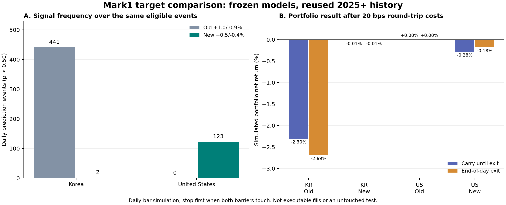

# Mark1 +0.5% / −0.4% 재학습 결과

작성: 2026-09-20T10:10:23.023208+00:00 (UTC)

국내·미국 모델 재학습, 기존 모델과의 같은 평가 사건 비교, 별도 추론 번들 저장을 완료했다. 이 보고서는 완료된 산출물을 읽어 만든 것이며 학습·추론 기준을 변경하지 않았다.

개발 구간 연구 기준 통과 시장: 없음. 모델의 연구 전용·배포 불허 상태를 유지한다. 기존 GUI와 매매 설정은 변경하지 않았고 주문도 실행하지 않았다.

## 실험 정의

- 입력: 직전 **완료된 30거래일 OHLCV + 평가일 시가(가상 진입가격)**. 당일 고가·저가·종가·거래량은 입력하지 않는다.
- 184개 특징 중 목표값에 종속적인 과거 장벽 도달률 16개도 +0.5%/−0.4% 기준으로 다시 계산했다.
- 성공: 일봉 고가가 진입가 × 1.005 이상이고, 일봉 저가가 진입가 × 0.996보다 높음. 둘 다 닿으면 손절 우선 실패로 처리한다.
- 매수 연구 신호는 보정된 성공확률이 **50% 초과**일 때만 발생한다. 정확히 50%는 신호가 아니다. 평가 결과를 보고 문턱을 바꾸지 않았다.
- 기존 최종 선택 구조를 고정했다: 국내 CatBoost 4분류(depth 6), 미국 CatBoost 이진분류(depth 8). 새로운 신경망 구조 탐색은 아니다.
- 2개 시장 × 2개 시간순 검증 구간 × 3개 시드(42·43·44) = **12개 학습 모델**. 최종 저장 번들은 마지막 구간의 6개 모델을 사용한다.
- 각 시장에서는 3개 모델의 원시 점수를 평균한 뒤 과거 확률 보정 구간에서 정한 Platt 보정을 적용한다.
- 이번 비교는 이전 선택 모델과 동일하게 실제 시가 표본을 사용했다. **가격 변형 증강은 하지 않았다**. 12개 모델 수는 원시 관측 수나 독립 표본 수를 뜻하지 않는다.

## 데이터와 시간 분리

FCEL·BNED·BBSI는 가격 단위 불연속이 확인되어 미국 학습·평가에서 종목 전체를 격리했다. 원본 DB를 고친 것이 아니다. SONY의 가격 단위 이상 경고와 미진단 기업행사·생존편향 위험은 남아 있다.

| 시장 | 정제 원시 창 수 | 격리 후 전체 허용 창 수 | 허용 종목 수 | 비교 평가 창 수 | 비교 기간 | 시장 거래일 수 |
|---|---:|---:|---:|---:|---|---:|
| 국내 | 2,668,151 | 2,668,151 | 2,049 | 261,385 | 2025-02-19 ~ 2026-08-21 | 368 |
| 미국 | 8,088,544 | 8,079,553 | 3,447 | 1,076,555 | 2025-02-18 ~ 2026-09-11 | 394 |

한 창은 한 종목·한 기준일의 과거 30봉과 당일 진입가로 구성된다. 위 창들은 여러 종목을 합친 수이며, 서로 겹치는 과거 봉을 사용하므로 독립 표본이 아니다. 모든 후속 연도 및 반기 경계에 30거래일 입력 중복 제거를 적용했다.

| 시장·구간 | 학습 기간 / 표본 수 | 조기 종료용 기간 / 표본 수 | 확률 보정 기간 / 표본 수 | 추가 검증 기간 / 표본 수 | 개발 감사 기간 / 표본 수 |
|---|---|---|---|---|---|
| 국내 · walk_2022 | 2012-01-02~2019-12-30 / 1,179,559 | 2020-02-17~2020-12-30 / 150,000 | 2021-02-17~2021-06-30 / 110,047 | 2021-08-12~2021-12-30 / 91,725 | 2022-02-17~2022-12-29 / 159,565 |
| 국내 · walk_2024 | 2014-01-02~2021-12-30 / 1,489,229 | 2022-02-17~2022-12-29 / 150,000 | 2023-02-15~2023-06-30 / 78,595 | 2023-08-14~2023-12-28 / 67,556 | 2024-02-15~2024-12-30 / 144,599 |
| 미국 · walk_2022 | 2012-01-03~2019-12-31 / 1,500,000 | 2020-02-14~2020-12-31 / 150,000 | 2021-02-17~2021-06-30 / 187,994 | 2021-08-13~2021-12-31 / 219,686 | 2022-02-15~2022-12-30 / 486,722 |
| 미국 · walk_2024 | 2014-01-02~2021-12-31 / 1,500,000 | 2022-02-15~2022-12-30 / 150,000 | 2023-02-15~2023-06-30 / 233,802 | 2023-08-15~2023-12-29 / 239,448 | 2024-02-14~2024-12-31 / 587,581 |

2025년 이후 기간은 이전 연구에서 이미 확인한 **재사용 역사 데이터**다. 손대지 않은 새로운 최종 테스트라고 해석하면 안 된다. 두 모델을 같은 격리 후 평가 사건에서 비교하지만, 기존 모델은 격리 전 학습했고 새 모델은 격리 후 학습했으므로 차이를 목표폭 변경 하나의 효과라고 단정할 수 없다.

## 신호와 백테스트 거래 수 구분

다음 신호는 전체 평가 창에서 p>0.5인 사건 수다. 현금·동시 보유·유동성 제한을 적용한 포트폴리오 매매 횟수와 다르다. 성공률도 각 모델 자신의 목표(+1/−0.9 또는 +0.5/−0.4)로 계산하므로 두 성공률은 동일한 라벨의 정확도 비교가 아니다. 거래가 거의 없어 수익률이 0%에 가까워진 결과를 예측력이나 수익성이 개선된 것으로 해석하면 안 된다. 아래 거래는 실제 계좌 체결이 아니다.

| 시장 | 모델 | 신호 수 | 신호일 수 | 신호 종목 수 | 신호 성공률 | 성공률 95% 구간 | 신호당 비용 후 평균 | 연구 기준 |
|---|---|---:|---:|---:|---:|---|---:|---|
| 국내 | 기존 +1% / −0.9% | 441 | 166 | 206 | 49.89% | 41.43% ~ 59.38% | -0.12% | 미통과 |
| 국내 | 신규 +0.5% / −0.4% | 2 | 2 | 2 | 50.00% | 산출 불가 | -0.15% | 미통과 |
| 미국 | 기존 +1% / −0.9% | 0 | 0 | 0 | 산출 불가 | 산출 불가 | 산출 불가 | 미통과 |
| 미국 | 신규 +0.5% / −0.4% | 123 | 104 | 29 | 57.72% | 48.65% ~ 66.94% | -0.03% | 미통과 |

신호가 0개면 성공률은 0%나 100%가 아니라 산출 불가다. 신뢰구간은 10거래일 블록 재표집 2,000회로 계산하며, 최소 50신호·20신호일·10종목에 못 미치면 제시하지 않는다. 비용 후 신호 평균은 동일 비중의 일봉 수익률 대용치이며 아래 포트폴리오 수익률과 다르다.

| 시장 | 모델 | 청산 방식 | 포트폴리오 매매 수 | 순수익률 | 최대 낙폭 | 경로 불확실 매매 수 |
|---|---|---|---:|---:|---:|---:|
| 국내 | 기존 +1% / −0.9% | 목표 미도달 시 보유 | 438 | -2.30% | -2.91% | 0 |
| 국내 | 기존 +1% / −0.9% | 당일 종가 청산 | 439 | -2.69% | -3.21% | 0 |
| 국내 | 신규 +0.5% / −0.4% | 목표 미도달 시 보유 | 2 | -0.01% | -0.03% | 0 |
| 국내 | 신규 +0.5% / −0.4% | 당일 종가 청산 | 2 | -0.01% | -0.03% | 0 |
| 미국 | 기존 +1% / −0.9% | 목표 미도달 시 보유 | 0 | 0.00% | 0.00% | 0 |
| 미국 | 기존 +1% / −0.9% | 당일 종가 청산 | 0 | 0.00% | 0.00% | 0 |
| 미국 | 신규 +0.5% / −0.4% | 목표 미도달 시 보유 | 121 | -0.28% | -0.50% | 0 |
| 미국 | 신규 +0.5% / −0.4% | 당일 종가 청산 | 123 | -0.18% | -0.37% | 0 |

기준 비용은 왕복 **20bps(0.20%)**. 시작자금은 국내 10,000,000원, 미국 $10,000다. 최대 20종목, 종목당 시작일 평가자산의 5.00%, 과거 20일 거래량 중앙값의 0.100%까지의 정수 주식 수를 허용했다. 실제 시가 체결을 가정하며, 당일 장중 매도대금을 같은 날 시가 매수에 재사용하지 않는다. 가격 누락은 자금 잠금·불확실 경로로 표시한다.

## 비용 민감도

| 시장 | 모델 | 청산 방식 | 0bps | 10bps | 20bps | 40bps |
|---|---|---|---:|---:|---:|---:|
| 국내 | 기존 +1% / −0.9% | 목표 미도달 시 보유 | 1.87% | -0.24% | -2.30% | -6.33% |
| 국내 | 기존 +1% / −0.9% | 당일 종가 청산 | 1.48% | -0.61% | -2.69% | -6.69% |
| 국내 | 신규 +0.5% / −0.4% | 목표 미도달 시 보유 | 0.01% | -0.00% | -0.01% | -0.03% |
| 국내 | 신규 +0.5% / −0.4% | 당일 종가 청산 | 0.01% | -0.00% | -0.01% | -0.03% |
| 미국 | 기존 +1% / −0.9% | 목표 미도달 시 보유 | 0.00% | 0.00% | 0.00% | 0.00% |
| 미국 | 기존 +1% / −0.9% | 당일 종가 청산 | 0.00% | 0.00% | 0.00% | 0.00% |
| 미국 | 신규 +0.5% / −0.4% | 목표 미도달 시 보유 | 0.90% | 0.31% | -0.28% | -1.46% |
| 미국 | 신규 +0.5% / −0.4% | 당일 종가 청산 | 1.03% | 0.42% | -0.18% | -1.38% |

비용은 매수·매도 실제 금액에 절반씩 적용했다. 호가 스프레드, 시장 충격, 부분 체결, 호가 제한과 체결 지연을 따로 재현하지 않았으므로 실행 가능 수익률을 보장하지 않는다. +0.5% 이익 / −0.4% 손실의 두 결과만 있다고 단순화하면 왕복 20bps에서 손익분기 성공률은 약 66.67%다. 새 연구 기준은 성공률 신뢰구간 하한이 이 값을 넘고 비용 후 평균수익 하한도 양수여야 한다. 미도달 종가 청산이 있어 실제 손익분기는 결과 구성에 따라 다를 수 있다.

## 목표폭 축소가 라벨에 준 영향

마지막 개발 감사 구간의 같은 창에 두 목표를 적용한 비교다. 양쪽 모두 도달하는 날이 많아지면 손절 우선 규칙 때문에 목표를 좁혀도 성공 라벨이나 매수 신호가 늘지 않을 수 있다.

| 시장 | 같은 감사 창 수 | 기존 성공 라벨 비율 | 신규 성공 라벨 비율 | 기존 양쪽 도달 비율 | 신규 양쪽 도달 비율 |
|---|---:|---:|---:|---:|---:|
| 국내 | 144,599 | 25.44% | 14.73% | 38.04% | 63.96% |
| 미국 | 587,581 | 28.35% | 19.94% | 23.45% | 53.11% |

## 개발 구간 검증과 모델 저장

| 시장·구간 | 추가 검증 연구 기준 | 개발 감사 연구 기준 | 최종 보존 트리 수(시드 42/43/44) |
|---|---|---|---|
| 국내 · walk_2022 | 미통과 | 미통과 | 1830/2128/1759 |
| 국내 · walk_2024 | 미통과 | 미통과 | 2951/3000/2976 |
| 미국 · walk_2022 | 미통과 | 미통과 | 420/399/260 |
| 미국 · walk_2024 | 미통과 | 미통과 | 497/1/977 |

미통과 사유(원본 결과의 검증 코드):

- 국내 walk_2022: net_return_lower_not_positive_after_20bps, precision_lower_not_above_two_outcome_cost_breakeven_2_over_3
- 국내 walk_2024: insufficient_signal_count, insufficient_signal_days, insufficient_symbol_count, net_return_lower_not_positive_after_20bps, precision_lower_not_above_two_outcome_cost_breakeven_2_over_3
- 미국 walk_2022: insufficient_signal_count, insufficient_signal_days, net_return_lower_not_positive_after_20bps, precision_lower_not_above_two_outcome_cost_breakeven_2_over_3
- 미국 walk_2024: net_return_lower_not_positive_after_20bps, precision_lower_not_above_two_outcome_cost_breakeven_2_over_3

저장 버전: `20260920-v1`. CPU 내보내기에서 4개 과거 입력 × 3개 진입가 × 2시장 = **24개 예측 비교**를 통과했고 입력·기존 보호 파일을 변경하지 않았다. 이는 수치 일치 검증이며 수익성이나 실전 준비 완료 인증이 아니다.

- 학습 산출물: `C:\Users\user\Desktop\dockdack-mark_1\outputs\mark1\half-20260920`
- 비교 백테스트: `C:\Users\user\Desktop\dockdack-mark_1\outputs\mark1\half-backtest-20260920`
- 독립 추론 번들: `C:\Users\user\Desktop\dockdack-mark_1\models\mark1_0504`
- 재실행·추론 사용법: [MARK1_0504 문서](../../docs/MARK1_0504.md)

원본 +1%/−0.9% 모델은 그대로 보존했다. 새 모델은 GUI에 자동 적용하지 않았고 자동주문·예약주문·실전 주문도 시작하지 않았다. 일봉 전체 구간의 보수적 성공 라벨이지, 임의의 장중 시점 이후 익절이 먼저 올 확률로 검증된 모델이 아니다.
