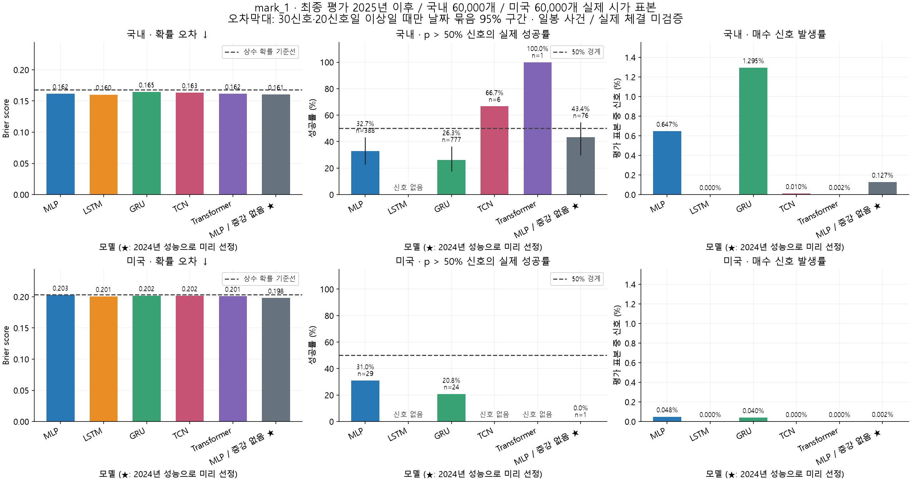
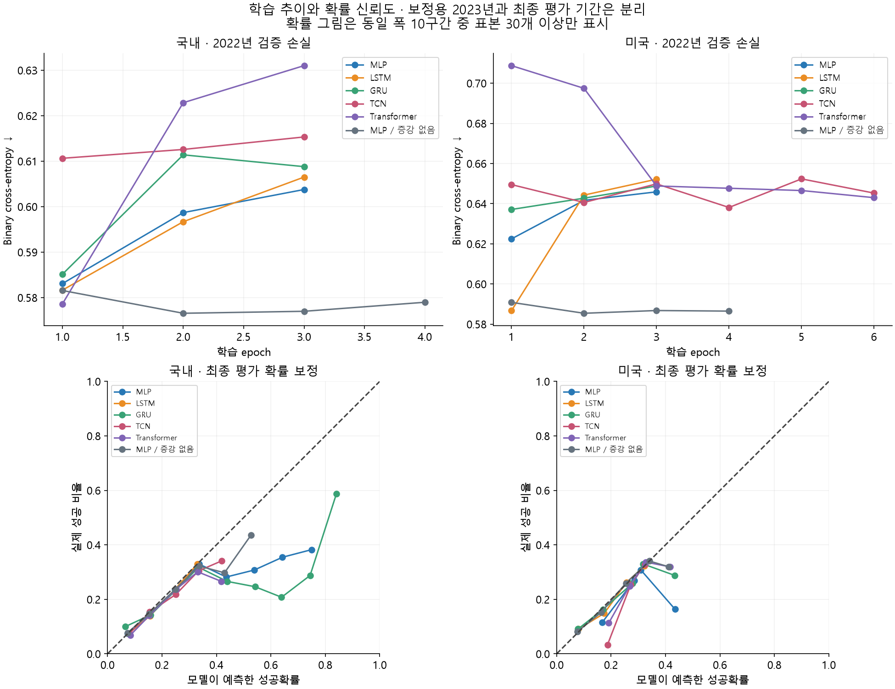

# mark_1 실험 결과

NVIDIA GeForce RTX 5080 · PyTorch 2.11.0+cu128 · seed 42 · 단일 시드 1차 비교

**실거래 검증이 아니다.** 결과의 성공은 `당일 고가 ≥ 진입가×1.01 AND 당일 저가 > 진입가×0.991`이다. 동일 일봉에서 양쪽 경계를 건드리면 실패로 처리한다. 장중 진입 이후의 선후관계는 일봉으로 판별할 수 없다.

## 이번 실행의 결론

아래에서 선정한 모델은 2024년 전체 확률 오차가 가장 작았던 모델이다. 이것은 매수 신호의 실제 성공률 50% 초과나 수익성 검증을 뜻하지 않는다. 50% 초과 구간의 신호 수·적중률·비용 후 대용 손익을 함께 확인해야 한다. 자동매매는 켜지 않았다.

## 공통 실험 설계

- 입력은 완료된 30봉 + 후보 진입가 질문 토큰 1개(총 31개)다. 당일 최종 고가·저가·종가·거래량은 입력하지 않았다.
- 시장별 원본 학습 사건 상한 200,000개. 실제 시가의 99%, 99.5%, 100%, 100.5%, 101% 가격으로 5배 질의했다. 독립 관측이 5배 늘어난 것은 아니다. 시장별 실제 선택 건수는 아래에 기재했다.
- 증강 없는 MLP도 같은 원본 시가를 5번 반복해 epoch당 제시 수/최대 업데이트 수를 맞췄다. 조기 종료 시 실제 epoch 수는 다르다.
- 학습 2010–2021 / 조기 종료 검증 2022 / 확률 보정 2023 / 모델 선정 2024 / 최종 평가 2025년 이후.
- 기간 경계에서 30거래일 입력이 이전 구간에 겹치는 표본을 제거했다. 검증·보정·선정·최종 평가 각각 최대 60,000개, 실제 시가만 사용했다.
- 2024년 Brier 오차, 동률이면 log loss로 선정을 기록한 뒤에 최종 평가했다. 2025년 이후 결과가 더 좋아 보이는 모델로 교체하지 않았다.
- 6 epoch 상한, patience 2, AdamW lr=0.001, weight decay=0.0001, batch 1024, hidden 64, dropout 0.15. 클래스 가중치·oversampling은 사용하지 않았다.
- 각 모델의 확률은 독립된 2023년 데이터로 양의 기울기 Platt 보정을 했다. 추후 시장 변화에도 보정이 유지된다는 보장은 없다.

## 기법 설명

| 기법 | 어떻게 보는가 | 비교하려는 점 |
|---|---|---|
| MLP | 31개 토큰을 펼쳐 비선형 층에 입력 | 복잡한 순서 모델이 정말 필요한지 확인하는 기본선 |
| LSTM | 기억 셀과 게이트로 순서대로 읽음 | 오래된 일봉 정보를 유지하는 효과 |
| GRU | LSTM보다 단순한 게이트로 순서 정보를 압축 | 적은 파라미터와 학습 시간의 효율 |
| TCN | 인과적 1차원 합성곱, dilation 1/2/4/8 | 짧고 긴 구간의 패턴을 병렬로 학습 |
| Transformer | 위치 정보와 attention으로 토큰 관계를 계산 | 멀리 떨어진 일봉 간 관계가 도움이 되는지 |

## 국내

선정 모델: **MLP / 증강 없음** (2024년 선정 지표 기준).

정제 승인 입력에서 학습기간 이력이 있는 2,049종목을 사용했다. 학습 원본 200,000개, epoch당 제시 1,000,000개, 평가 60,000개다. 여러 종목을 합친 수이며 종목별 수가 아니다.

| 모델 | 파라미터 | 최적 epoch / 수행 | 학습 초 | 선정 Brier ↓ | 최종 Brier ↓ | ROC AUC ↑ | AP ↑ |
|---|---:|---:|---:|---:|---:|---:|---:|
| MLP | 44,161 | 1 / 3 | 3.7 | 0.1833 | 0.1617 | 0.6346 | 0.2889 |
| LSTM | 52,545 | 1 / 3 | 30.5 | 0.1838 | 0.1602 | 0.6399 | 0.2961 |
| GRU | 39,425 | 1 / 3 | 33.4 | 0.1846 | 0.1645 | 0.6205 | 0.2760 |
| TCN | 99,521 | 1 / 3 | 9.5 | 0.1841 | 0.1633 | 0.6072 | 0.2805 |
| Transformer | 67,777 | 1 / 3 | 14.8 | 0.1836 | 0.1616 | 0.6268 | 0.2807 |
| MLP / 증강 없음 | 44,161 | 2 / 4 | 4.6 | 0.1821 | 0.1606 | 0.6381 | 0.2923 |
| 상수 확률 24.96% | 0 | — | — | 0.1893 | 0.1680 | 0.5000 | 0.2111 |

| 모델 | p > 50% 신호 / 60,000 | 발생률 | 실제 성공률 | 날짜 묶음 95% 구간 | 비용 20bp 후 가상 평균 손익 |
|---|---:|---:|---:|---:|---:|
| MLP | 388 | 0.65% | 32.73% | 22.69%–43.28% | -0.47% |
| LSTM | 0 | 0.00% | — | — | — |
| GRU | 777 | 1.29% | 26.25% | 17.56%–36.35% | -0.60% |
| TCN | 6 | 0.01% | 66.67% | 표본 부족 | 0.47% |
| Transformer | 1 | 0.00% | 100.00% | 표본 부족 | 0.80% |
| MLP / 증강 없음 | 76 | 0.13% | 43.42% | 29.54%–54.55% | -0.25% |

MLP 가격 증강 효과: 최종 Brier 차이(증강−미증강) **+0.00109**. 음수면 증강 쪽 오차가 작다. 단일 시드 결과로 보편적인 효과를 단정할 수 없다.

## 미국

선정 모델: **MLP / 증강 없음** (2024년 선정 지표 기준).

정제 승인 입력에서 학습기간 이력이 있는 3,450종목을 사용했다. 학습 원본 200,000개, epoch당 제시 1,000,000개, 평가 60,000개다. 여러 종목을 합친 수이며 종목별 수가 아니다.

| 모델 | 파라미터 | 최적 epoch / 수행 | 학습 초 | 선정 Brier ↓ | 최종 Brier ↓ | ROC AUC ↑ | AP ↑ |
|---|---:|---:|---:|---:|---:|---:|---:|
| MLP | 44,161 | 1 / 3 | 3.9 | 0.2035 | 0.2026 | 0.5443 | 0.3053 |
| LSTM | 52,545 | 1 / 3 | 31.2 | 0.2019 | 0.2005 | 0.5550 | 0.2947 |
| GRU | 39,425 | 1 / 3 | 32.9 | 0.2030 | 0.2018 | 0.5661 | 0.3228 |
| TCN | 99,521 | 4 / 6 | 18.8 | 0.2022 | 0.2016 | 0.5624 | 0.3271 |
| Transformer | 67,777 | 6 / 6 | 29.4 | 0.2018 | 0.2009 | 0.5760 | 0.3328 |
| MLP / 증강 없음 | 44,161 | 2 / 4 | 4.8 | 0.1985 | 0.1980 | 0.5974 | 0.3393 |
| 상수 확률 27.59% | 0 | — | — | 0.2040 | 0.2034 | 0.5000 | 0.2839 |

| 모델 | p > 50% 신호 / 60,000 | 발생률 | 실제 성공률 | 날짜 묶음 95% 구간 | 비용 20bp 후 가상 평균 손익 |
|---|---:|---:|---:|---:|---:|
| MLP | 29 | 0.05% | 31.03% | 표본 부족 | -0.51% |
| LSTM | 0 | 0.00% | — | — | — |
| GRU | 24 | 0.04% | 20.83% | 표본 부족 | -0.70% |
| TCN | 0 | 0.00% | — | — | — |
| Transformer | 0 | 0.00% | — | — | — |
| MLP / 증강 없음 | 1 | 0.00% | 0.00% | 표본 부족 | -1.10% |

MLP 가격 증강 효과: 최종 Brier 차이(증강−미증강) **+0.00464**. 음수면 증강 쪽 오차가 작다. 단일 시드 결과로 보편적인 효과를 단정할 수 없다.

## 해석과 한계

- Brier는 확률 오차이며 작을수록 좋다. AP는 양성 순위 품질이며 기준선은 사건 발생률이다. 대다수의 실패를 모두 실패로 예측해 얻는 높은 정확도만으로 성능을 판단하지 않았다.
- `확률 > 50%`는 모델 추정치에 대한 조건이다. 선택된 신호의 실제 성공률이 반드시 50%를 넘는다는 뜻은 아니다. 정확히 50%는 HOLD다.
- 신호가 없는 경우 적중률과 평균 손익은 계산 불가(—)다. 신호가 나오도록 기준을 사후 조정하지 않았다.
- 신뢰구간은 같은 날짜의 종목들을 묶어 400번 재표집했다. 날짜 간 시계열 의존성·단일 시드 모델 학습 불확실성은 포함하지 않는다.
- 30신호 또는 20신호일 미만은 구간을 표시하지 않았다. 특히 1건 성공/1건 신호의 100%는 신뢰할 만한 100% 성공률을 뜻하지 않는다. 원시 계산값은 JSON에 보존했다.
- 손익은 매 신호를 독립적으로 진입했다고 가정한 OHLC 대용치다. 양쪽 터치는 손절 우선, 미도달은 당일 종가 청산으로 가정했다. 실제 GUI의 손익·포트폴리오 수익률·체결 기록이 아니다.
- 후보 가격이 실제 거래되지 않았을 수 있고 당일 극값이 진입 전에 발생했을 수 있다. 특히 장중 현재가 적용은 실제 시가 평가와 다른 분포이며 재보정/분봉 검증이 필요하다.
- 데이터의 현재 종목목록에 따른 생존 편향, 타깃 봉 관측 가능성, 과거 조정주가 일관성, 저유동성 필터의 대리지표 한계가 남아 있다.
- 기본 현행 GUI는 감시/자동주문 OFF. 이 실험은 원본/정제 DB 수정, 계좌 조회 또는 주문을 수행하지 않았다.

## 재현 자료

원 실행 기록: `C:\Users\user\Desktop\dockdack-mark_1\outputs\mark1\experiment-20260916`. 시장별 `selection_locked.json`, `dataset_manifest.json`, 모델별 `history.json`, `result.json`, `test_predictions.npz` 보관.

[전략 및 실행 방법](../../docs/mark1-strategy.md) · [GUI 안내](../../docs/MARK1_GUI.md)

확률 보정 해석은 [scikit-learn 공식 문서](https://scikit-learn.org/stable/modules/calibration.html), 봉 기반 체결 순서 가정의 한계는 [TradingView 공식 전략 문서](https://www.tradingview.com/pine-script-docs/concepts/strategies/)를 참고했다.
