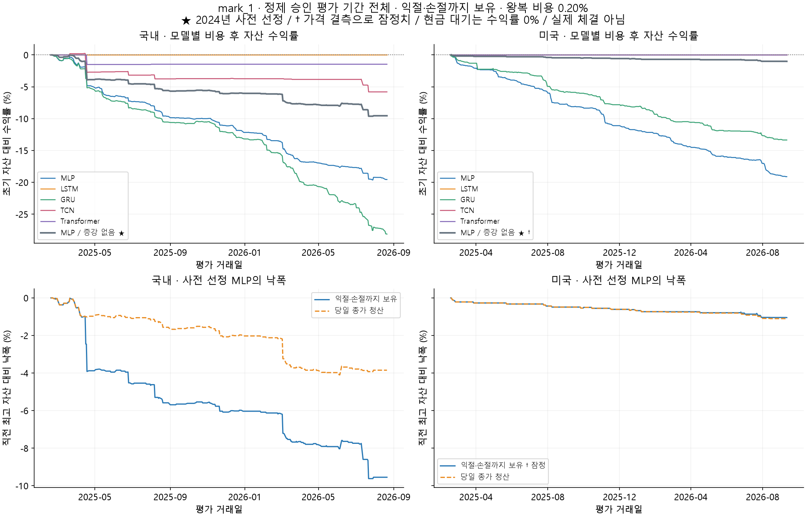
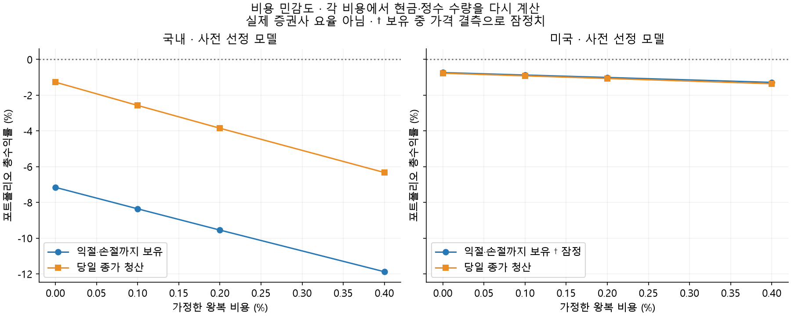

# mark_1 백테스트

주 결과: **익절·손절까지 보유**. 기존 가중치·2023년 보정·매수 문턱을 고정하고 재학습하지 않았다. 2024년에 선정된 국내·미국 `mlp_no_price_aug`를 그대로 유지했다. 이번 수익률 순위로 모델을 다시 고르지 않는다.

## 확정한 규칙

- 입력은 **과거 완료 30일봉 + 당일 가상 매수가**. 실제 시가를 당일 가상 매수가로 놓았다.
- 당일 최종 고가·저가·종가·거래량은 매수 판단에 들어가지 않는다. 학습 때 증강한 5가격을 독립된 실제 체결로 세지 않는다.
- 미보유 상태에서 보정 확률 **50% 초과**일 때만 진입. 평균 진입가 대비 **+1% 익절 / −0.9% 손절**.
- **같은 일봉의 익절·손절 경계가 모두 닿으면 손절 우선**. 이 규칙은 사용자 확인 사항이다.
- 다일 보유의 다음 시가가 이미 경계를 넘은 경우에는 알려진 최초 시점인 시가에 먼저 청산한다. 하락 갭 손실은 −0.9%보다 클 수 있다. 이후 장중 순서가 불명확한 두 경계 충돌은 손절로 처리한다.
- 당일 미도달 시 익절·손절까지 보유하는 경우와 당일 종가 청산하는 경우를 모두 제시한다. 후자는 기존 하루 단위 학습 목표에 더 가까운 별도 전략이다.

## 포트폴리오 가정

- 초기 자금: 국내 10,000,000원 / 미국 10,000달러. 양 시장 별도 계좌이며 환율 변환·합산하지 않는다.
- 종목당 거래일 시작 자산의 최대 5%, 최대 20종목. 정수 주식 수, 현금 범위 내 매수, 공매도/레버리지/추가 매수 없음.
- 한 종목 주문 수량은 직전 완료 20일 거래량 중앙값의 0.10% 이내. 종목 간 우선순위는 알려진 시가 기준 확률 내림차순, 동률은 고정 종목 ID.
- 시가 진입을 모두 처리한 뒤 당일 고가/저가 청산을 처리한다. 오후 매도대금으로 같은 날 시가 매수를 소급하지 않는다. 시가 갭 청산 자금의 같은 시가 재사용은 이상적 동시 체결 가정이다.
- 기본 왕복 비용 0.20%, 매수·매도에 절반씩 실제 거래금액에 부과. 0%, 0.1%, 0.2%, 0.4% 비용을 별도 계산했다. 수수료·세금·호가·슬리피지의 정확한 개별 모델이 아닌 가정이다.
- 시가를 본 뒤 정확히 그 시가로 체결되는 이상적 가정이 있다. 경매/주문 지연/호가 단위/미체결/상하한가 체결 제한은 재현하지 않았다. 배당·기업행사·조정주가에 따른 현금/수량 변화도 별도로 재구성하지 않았다.
- 기간 마지막 날에는 종가로 평가 종료 청산한다. 거래 없는 날도 자산 곡선에 포함한다. Sharpe는 무위험수익 0, 연 252거래일 가정이다.





## 국내

기간 **2025-02-19~2026-08-21**, 368거래일. 학습과 별개인 승인 평가 표본 **261,486개** 전체를 사용했다. 이전 6만 개 평가는 그 부분집합이라 이번 결과는 새로운 독립 홀드아웃은 아니다.

| 모델 | 보유 방식 | 거래 수 | 비용 후 승률 | 총수익률 | 최대 낙폭 | Sharpe | 평균 익스포저 | 불확실 거래 |
|---|---|---:|---:|---:|---:|---:|---:|---:|
| MLP | 익절·손절 | 743 | 34.86% | -19.56% | -19.62% | -5.11 | 9.51% | 0 |
| MLP | 당일 종가 | 750 | 34.53% | -14.05% | -14.12% | -5.37 | 9.62% | 0 |
| LSTM | 익절·손절 | 0 | — | 0.00% | 0.00% | — | 0.00% | 0 |
| LSTM | 당일 종가 | 0 | — | 0.00% | 0.00% | — | 0.00% | 0 |
| GRU | 익절·손절 | 1,161 | 32.04% | -28.13% | -28.13% | -6.40 | 14.92% | 0 |
| GRU | 당일 종가 | 1,172 | 31.83% | -23.45% | -23.45% | -6.48 | 15.08% | 0 |
| TCN | 익절·손절 | 24 | 58.33% | -5.80% | -6.02% | -1.83 | 0.32% | 0 |
| TCN | 당일 종가 | 26 | 53.85% | 0.25% | -0.20% | 0.83 | 0.35% | 0 |
| Transformer | 익절·손절 | 2 | 50.00% | -1.46% | -1.50% | -0.81 | 0.03% | 0 |
| Transformer | 당일 종가 | 2 | 50.00% | 0.03% | -0.01% | 0.60 | 0.03% | 0 |
| MLP / 증강 없음 ★ | 익절·손절 | 267 | 41.20% | -9.55% | -9.62% | -2.72 | 3.50% | 0 |
| MLP / 증강 없음 ★ | 당일 종가 | 271 | 40.59% | -3.85% | -4.10% | -2.17 | 3.56% | 0 |

사전 선정 모델의 주 결과: 최종 자산 **9,045,277.07 KRW**, 순손익 **-954,722.93 KRW**, 비용 246,297.27 KRW. 확률 조건 통과 324건 중 실제 포트폴리오 거래는 267건이다.

전체 매수 신호의 **같은 날 학습 사건 적중률**은 41.36%다. 위 표의 **비용 후 거래 승률**은 다른 지표다. 특히 다일 보유 결과는 모델의 하루 단위 확률 보정 대상이 아니다.

양쪽 경계 충돌 후 손절: 128건. 불확실한 보유 경로: 0건 / 가격 결측 평가일 0일. 해당 모델의 실제 보유 경로에서는 가격 결측이 없었다.

### 연도별 자산 변화

| 연도 | 해당 구간 수익률 |
|---|---:|
| 2025 (평가 기간에 포함된 부분) | -6.03% |
| 2026 (평가 기간에 포함된 부분) | -3.74% |

### 손실이 큰 거래 5건

| 종목 | 진입일 | 청산일 | 진입 → 청산 가격 | 비용 후 거래 수익률 | 청산 사유 |
|---|---|---|---:|---:|---|
| KRX:288330 | 2025-04-15 | 2025-04-16 | 6280 → 4400 | -30.08% | GAP_STOP |
| KRX:288330 | 2025-04-17 | 2025-04-18 | 3080 → 2160 | -30.01% | GAP_STOP |
| KRX:102940 | 2026-07-21 | 2026-07-22 | 21100 → 16500 | -21.96% | GAP_STOP |
| KRX:028300 | 2026-07-10 | 2026-07-13 | 36600 → 29550 | -19.42% | GAP_STOP |
| KRX:007390 | 2025-08-06 | 2025-08-07 | 24750 → 21500 | -13.30% | GAP_STOP |

`GAP_STOP`은 다음 시가가 손절선보다 아래여서 그 시가로 처리한 경우다. 지정 손절률이 실제 손실 상한은 아니다. 일봉이 모두 같은 가격인 상하한가/단일가 상황에서도 체결된다고 가정하므로 이 가격조차 실제 체결을 보장하지 않는다.

[선정 모델 보유형 거래내역](domestic-selected-carry-trades.json) · [선정 모델 당일 청산 거래내역](domestic-selected-eod-trades.json)

## 미국

기간 **2025-02-18~2026-09-11**, 394거래일. 학습과 별개인 승인 평가 표본 **1,078,313개** 전체를 사용했다. 이전 6만 개 평가는 그 부분집합이라 이번 결과는 새로운 독립 홀드아웃은 아니다.

| 모델 | 보유 방식 | 거래 수 | 비용 후 승률 | 총수익률 | 최대 낙폭 | Sharpe | 평균 익스포저 | 불확실 거래 |
|---|---|---:|---:|---:|---:|---:|---:|---:|
| MLP | 익절·손절 | 529 | 14.18% | -19.11% | -19.11% | -9.56 | 6.48% | 0 |
| MLP | 당일 종가 | 529 | 14.18% | -19.11% | -19.11% | -9.56 | 6.48% | 0 |
| LSTM | 익절·손절 | 0 | — | 0.00% | 0.00% | — | 0.00% | 0 |
| LSTM | 당일 종가 | 0 | — | 0.00% | 0.00% | — | 0.00% | 0 |
| GRU | 익절·손절 | 484 | 23.97% | -13.35% | -13.35% | -7.41 | 5.74% | 0 |
| GRU | 당일 종가 | 484 | 24.17% | -13.37% | -13.37% | -7.48 | 5.69% | 0 |
| TCN | 익절·손절 | 0 | — | 0.00% | 0.00% | — | 0.00% | 0 |
| TCN | 당일 종가 | 0 | — | 0.00% | 0.00% | — | 0.00% | 0 |
| Transformer | 익절·손절 | 0 | — | 0.00% | 0.00% | — | 0.00% | 0 |
| Transformer | 당일 종가 | 0 | — | 0.00% | 0.00% | — | 0.00% | 0 |
| MLP / 증강 없음 ★ | 익절·손절 | 28 | 17.86% | -1.01% | -1.05% | -3.06 | 1.69% | 2 |
| MLP / 증강 없음 ★ | 당일 종가 | 30 | 13.33% | -1.06% | -1.10% | -3.26 | 0.38% | 0 |

사전 선정 모델의 주 결과: 최종 자산 **9,899.16 USD**, 순손익 **-100.84 USD**, 비용 27.49 USD. 확률 조건 통과 30건 중 실제 포트폴리오 거래는 28건이다.

전체 매수 신호의 **같은 날 학습 사건 적중률**은 13.33%다. 위 표의 **비용 후 거래 승률**은 다른 지표다. 특히 다일 보유 결과는 모델의 하루 단위 확률 보정 대상이 아니다.

양쪽 경계 충돌 후 손절: 14건. 불확실한 보유 경로: 2건 / 가격 결측 평가일 104일. **가격 결측이 있어 주 결과는 잠정치이며 완전한 백테스트로 해석하면 안 된다.**

### 연도별 자산 변화

| 연도 | 해당 구간 수익률 |
|---|---:|
| 2025 (평가 기간에 포함된 부분) | -0.64% |
| 2026 (평가 기간에 포함된 부분) | -0.37% |

### 손실이 큰 거래 5건

| 종목 | 진입일 | 청산일 | 진입 → 청산 가격 | 비용 후 거래 수익률 | 청산 사유 |
|---|---|---|---:|---:|---|
| ND:OMEX | 2025-05-23 | 2025-05-23 | 0.9388 → 0.930351 | -1.10% | STOP |
| ND:DARE | 2025-08-08 | 2025-08-08 | 2.03 → 2.01173 | -1.10% | STOP |
| ND:MREO | 2025-12-29 | 2025-12-29 | 0.25 → 0.24775 | -1.10% | STOP |
| ND:MBIO | 2025-07-25 | 2025-07-25 | 2.02 → 2.00182 | -1.10% | STOP |
| ND:RANI | 2025-11-17 | 2025-11-17 | 1.82 → 1.80362 | -1.10% | STOP |

`GAP_STOP`은 다음 시가가 손절선보다 아래여서 그 시가로 처리한 경우다. 지정 손절률이 실제 손실 상한은 아니다. 일봉이 모두 같은 가격인 상하한가/단일가 상황에서도 체결된다고 가정하므로 이 가격조차 실제 체결을 보장하지 않는다.

[선정 모델 보유형 거래내역](us-selected-carry-trades.json) · [선정 모델 당일 청산 거래내역](us-selected-eod-trades.json)

## 결측과 해석 한계

정제 DB는 승인된 학습 구간들의 합집합이다. 신호 다음날부터 가격 기록이 끊길 수 있다. 없는 날짜를 정상 거래일처럼 보간하거나 미래 결측을 미리 알고 전날 매도하지 않았다.

보유 중 가격이 없거나 거래량이 0이면 자금은 묶고 마지막 관측 종가로 잠정 평가한다. 다음 관측 시가에 정리하되 해당 거래의 장중 익절/손절 경로는 불확실로 표시한다. 마지막까지 누락이면 마지막 알려진 가격으로 평가 종료할 뿐 실제 청산이라고 부르지 않는다. 이 경우 수익률·낙폭·Sharpe도 잠정치다.

최대 낙폭이 작더라도 거래가 적어 대부분 현금이면 전략이 우수하다는 의미는 아니다. 현재 목록의 생존 편향, 학습기간 승인 종목만 사용하는 모집단, 정답일이 관측된 표본만 존재하는 선택 편향이 남아 있다. 이번 결과로 모델을 다시 고르거나 확률 문턱을 바꾸지 않았다.

일봉 내부 경로·갭 체결 가정의 일반적 한계는 [TradingView 공식 전략 설명](https://www.tradingview.com/pine-script-docs/concepts/strategies/)과 같이 실제 더 짧은 주기의 가격 및 체결 자료가 있어야 해소할 수 있다.

## 재현

```powershell
& 'C:/Users/user/Desktop/dockdack/.venv-ml-cuda/Scripts/python.exe' -m examples.backtest_mark1 --output-dir outputs/mark1/backtest-new --device cuda
& 'C:/Users/user/Desktop/dockdack/.venv-ml-cuda/Scripts/python.exe' -m examples.report_mark1_backtest --run outputs/mark1/backtest-20260916 --destination reports/mark1-backtest-20260916 --primary carry
```

전체 모델의 거래·현금·자산·거절내역과 예측: `C:\Users\user\Desktop\dockdack-mark_1\outputs\mark1\backtest-20260916`. `summary.json`에 DB·체크포인트·선정 기록 해시와 이전 예측 재현 오차를 보관했다. 원본/정제 DB와 가중치는 읽기만 했으며 주문·자동매매 재시작을 하지 않았다.
