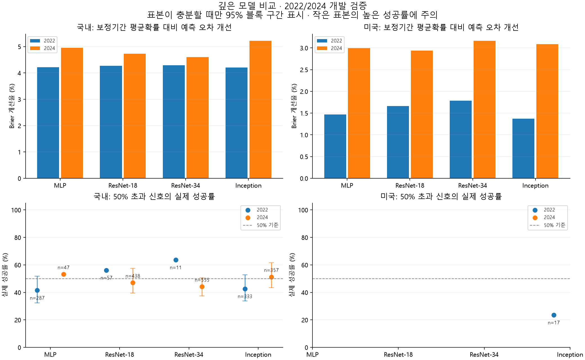
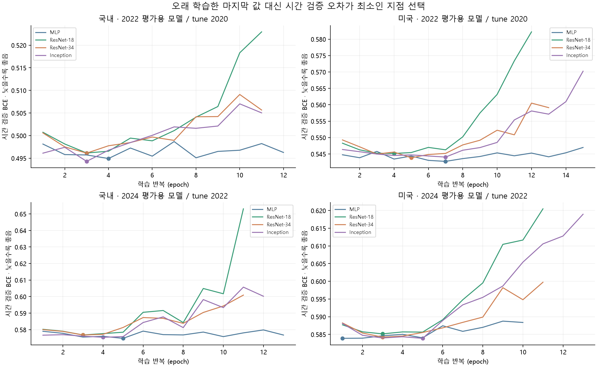
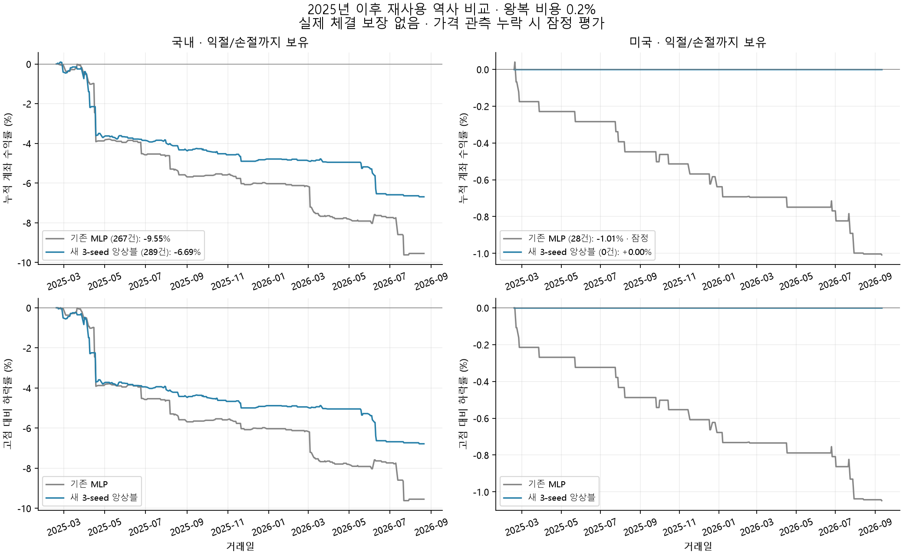

# mark_1 심층 모델 연구 결과

원본·정제 DB와 기존 배포 모델을 보존한 별도 연구다. 자동매매를 켜거나 주문하지 않았다.

## 결론

- 국내: 두 개발 구간의 평균 Brier 개선율로 `inception` 선택. 사전 연구 기준 미통과. 통과 여부와 무관하게 기존 자동매매에 배포하지 않았다.
- 미국: 두 개발 구간의 평균 Brier 개선율로 `resnet34` 선택. 사전 연구 기준 미통과. 통과 여부와 무관하게 기존 자동매매에 배포하지 않았다.

2025년 이후 재사용 역사 평가의 실제 결과를 우선 판단한다. 개발 기간의 확률 오차 개선은 매수 신호 성공률이나 순이익 개선과 같지 않다.

- 국내 동일 원본 표본 261,385개 (2025-02-19–2026-08-21, 368거래일): 원신호 성공률 41.36% → 36.16% (신호 324 → 307개). 비용 포함 보유형 수익률 -9.55% → -6.69%; 당일 청산형 -3.85% → -5.37%.
  국내 매수 신호 성공률은 오히려 하락했다. 보유형과 당일 청산형 중 유리한 결과만 골라 개선으로 판단하지 않는다.
- 미국 동일 원본 표본 1,077,696개 (2025-02-18–2026-09-11, 394거래일): 원신호 성공률 13.33% → — (신호 30 → 0개). 비용 포함 보유형 수익률 -1.01% → 0.00%; 당일 청산형 -1.06% → 0.00%.
  미국 새 모델은 신호가 없어 성공률을 정의할 수 없다. 무거래 수익률 0%는 수익성 입증이 아니다.
  미국 기존 보유형 결과에는 가격 공백으로 인한 잠정 평가가 포함된다. 자세한 관측 상태는 아래 표에 표시했다.

실제 완료: 20회 학습, 총 235 epoch. 기록된 학습 epoch 시간 합계 57.4분 (자료 준비·별도 감사·백테스트 시간 제외).

## 기존 과신이 줄었는가: 동일 2024 표본 진단

개발 자료의 추가 진단이며 별도의 독립 시험이나 모델 재선정 근거로 쓰지 않았다. 새 앙상블과 동일한 2024 원본 표본 색인으로 기존 모델을 다시 계산했다. 평가 대상 원본은 같지만 각 모델이 고른 매수 신호 집합은 서로 다르다.

| 시장 | 모델 | 신호 | 평균 예측 | 실제 성공 | 큰 하락 갭 신호 비중 | 비용 후 일봉 proxy |
|---|---|---:|---:|---:|---:|---:|
| 국내 | 기존 MLP | 123 | 60.77% | 34.15% | 97.56% | -0.397% |
| 국내 | 새 앙상블 | 284 | 51.60% | 50.00% | 25.70% | -0.137% |

큰 하락 갭은 log(시가/전일 종가)<−0.02인 진단 구간이다. 이 구간을 사후에 제외하거나 거래 규칙을 변경하지 않았다. 과신 감소와 비용 후 수익성 입증은 별개다.

## 무엇을 바꿨는가

- 과거 30일 + 현재 후보가격 입력은 유지했다. 당일 최종 고가·저가·종가·거래량은 입력하지 않는다.
- 변동성으로 조정한 가격·봉 모양·거래량 등 18개 특징과 별도 후보가격 헤드를 사용했다.
- MLP 215,684개, ResNet-18-inspired 1,040,708개, ResNet-34-inspired 1,886,148개, InceptionTime-inspired 259,396개 파라미터를 비교했다. 파라미터 수는 데이터 수가 아니다.
- 실제 시가 성공 BCE + 0.25×4상태 CE + 0.10×가상가격 성공 BCE. 가상가격은 ±0.25%/±0.5%에서 골랐다. 합성 표본은 독립된 실제 거래가 아니다.
- 시장·분할당 기본 학습 사례 최대 75만 개, tune 최대 10만 개. calibration/selection은 해당 적격 자료 전체. 최대 40 epoch, 최소 10 epoch, 개선 없는 8 epoch 뒤 종료했다.
- 구조를 먼저 선택한 다음 seed 42·43·44의 raw success logit 평균을 별도 연도로 다시 보정했다. 좋은 seed만 고르지 않았다.
- 매수 p>50%, 익절 +1%, 손절 −0.9%, 양쪽 접촉 시 손절 우선은 그대로다.

이전 모델 대비 입력·학습자료·손실도 변경했으므로 성능 차이를 층 수만의 효과로 해석할 수 없다. 새 ResNet-18/34 쌍은 동일한 새 조건에서 깊이를 비교한다.

## 개발 검증: 모든 구조를 공개

| 시장 | 평가연도 | 모델 | 최적/실행 epoch | Brier | 상수 대비 개선 | 신호 | 성공률 | 비용 후 평균 일봉 proxy |
|---|---:|---|---:|---:|---:|---:|---:|---:|
| 국내 | 2022 | MLP | 4/12 | 0.19551 | 4.22% | 287 | 41.46% | -0.288% |
| 국내 | 2022 | ResNet-18 | 3/11 | 0.19542 | 4.26% | 57 | 56.14% | -0.018% |
| 국내 | 2022 | ResNet-34 | 3/11 | 0.19537 | 4.29% | 11 | 63.64% | 0.109% |
| 국내 | 2022 | Inception | 3/11 | 0.19554 | 4.20% | 333 | 42.64% | -0.220% |
| 국내 | 2024 | MLP | 5/13 | 0.18031 | 4.96% | 47 | 53.19% | 0.016% |
| 국내 | 2024 | ResNet-18 | 3/11 | 0.18075 | 4.73% | 438 | 47.03% | -0.155% |
| 국내 | 2024 | ResNet-34 | 3/11 | 0.18098 | 4.60% | 555 | 44.14% | -0.230% |
| 국내 | 2024 | Inception | 4/12 | 0.17981 | 5.22% | 357 | 51.26% | -0.113% |
| 미국 | 2022 | MLP | 7/15 | 0.20588 | 1.47% | 0 | — | — |
| 미국 | 2022 | ResNet-18 | 4/12 | 0.20547 | 1.66% | 0 | — | — |
| 미국 | 2022 | ResNet-34 | 5/13 | 0.20522 | 1.78% | 0 | — | — |
| 미국 | 2022 | Inception | 7/15 | 0.20608 | 1.37% | 17 | 23.53% | -0.542% |
| 미국 | 2024 | MLP | 1/10 | 0.19717 | 3.00% | 0 | — | — |
| 미국 | 2024 | ResNet-18 | 3/11 | 0.19730 | 2.94% | 0 | — | — |
| 미국 | 2024 | ResNet-34 | 3/11 | 0.19684 | 3.16% | 0 | — | — |
| 미국 | 2024 | Inception | 5/13 | 0.19699 | 3.09% | 0 | — | — |

Brier는 낮을수록 좋다. 상수 기준은 평가연도 정답 비율이 아니라 이전 calibration 연도 성공 비율로 고정했다. 신호 없음은 성공률 0%가 아니라 정의 불가다. 막대는 자료가 충분한 경우의 95% 블록 재표집 구간이며, 표시되지 않은 작은 표본에 불확실성이 없다는 뜻이 아니다.

## 선택 구조의 세 초기값과 앙상블

| 시장 | seed | 2024 신호 | 성공률 | Brier |
|---|---:|---:|---:|---:|
| 국내 | 42 | 357 | 51.26% | 0.17981 |
| 국내 | 43 | 749 | 49.13% | 0.18021 |
| 국내 | 44 | 26 | 50.00% | 0.17995 |
| 국내 | 앙상블 | 284 | 50.00% | 0.17962 |
| 미국 | 42 | 0 | — | 0.19684 |
| 미국 | 43 | 0 | — | 0.19677 |
| 미국 | 44 | 0 | — | 0.19712 |
| 미국 | 앙상블 | 0 | — | 0.19665 |

국내 앙상블 10거래일 블록 재표집 성공률 95% 구간: 42.11%–59.28%. 비용 후 proxy 평균 구간: -0.287%–0.035%. 신호 발생일 83일. 표본 부족 시 구간은 제시하지 않는다.

미국 앙상블 10거래일 블록 재표집 성공률 95% 구간: —–—. 비용 후 proxy 평균 구간: —–—. 신호 발생일 0일. 표본 부족 시 구간은 제시하지 않는다.

연구 기준: 200신호·50신호일 이상, 블록 재표집 성공률 하한 >50%, 비용 후 proxy 평균 하한 >0. 두 개발 구간과 최종 앙상블 모두 통과해야 한다. 다중 모델 선택 편향까지 제거한 검정이나 실거래 승인은 아니다.

## 이미 본 2025+ 자료: 동일 표본·동일 체결 가정 비교

이 기간은 이미 이전 연구에서 확인했다. 이번 구조 선택에는 쓰지 않았지만 **새로운 미사용 시험이 아닌 재사용 역사 평가**다.

| 시장 | 모델 | 청산 방식 | 원신호 수 / 성공률 | 거래 | 거래 승률 | 계좌 수익률 | 최대 낙폭 | 평균 노출 | 완전 관측 |
|---|---|---|---:|---:|---:|---:|---:|---:|---|
| 국내 | 기존 | 익절/손절 보유 | 324 / 41.36% | 267 | 41.20% | -9.55% | -9.62% | 3.50% | True |
| 국내 | 기존 | 당일 종가 청산 | 324 / 41.36% | 271 | 40.59% | -3.85% | -4.10% | 3.56% | True |
| 국내 | 새 앙상블 | 익절/손절 보유 | 307 / 36.16% | 289 | 37.37% | -6.69% | -6.78% | 3.81% | True |
| 국내 | 새 앙상블 | 당일 종가 청산 | 307 / 36.16% | 290 | 37.24% | -5.37% | -5.46% | 3.82% | True |
| 미국 | 기존 | 익절/손절 보유 | 30 / 13.33% | 28 | 17.86% | -1.01% | -1.05% | 1.69% | False |
| 미국 | 기존 | 당일 종가 청산 | 30 / 13.33% | 30 | 13.33% | -1.06% | -1.10% | 0.38% | True |
| 미국 | 새 앙상블 | 익절/손절 보유 | 0 / — | 0 | — | 0.00% | 0.00% | 0.00% | True |
| 미국 | 새 앙상블 | 당일 종가 청산 | 0 / — | 0 | — | 0.00% | 0.00% | 0.00% | True |

시가 즉시 진입·최대 20종목·종목당 계좌 5%·과거 20일 중앙 거래량의 0.1% 한도·정수 주식·왕복 비용 20bps. 갭 손절은 다음 관측 시가로 계산하며 손실은 −0.9%를 넘을 수 있다. 같은 날 두 경계가 닿으면 손절 우선이다.

원신호 성공률은 p>50%인 모든 적격 표본의 당일 정답 비율이다. 거래 승률은 자금·보유 제한을 거쳐 모의 체결된 거래의 비용 후 이익 비율이므로 서로 다르다. 거래가 없어서 계좌 수익률 0%인 모델은 수익성 개선을 입증한 모델이 아니다.

가격 관측 누락·거래량 0은 임의 체결로 보충하지 않는다. 경로 불확실 거래와 마지막 오래된 가격 평가는 잠정치로 표시한다. 가격제한·호가·부분체결·지연·실제 세금은 완전히 모델링하지 않았다. 당일 종가 청산은 보유 지속과 다른 가정이며 사용자 매도 조건을 변경한 것이 아니다.

## 비용 민감도

| 시장 | 모델 | 청산 | 왕복 비용 | 계좌 수익률 |
|---|---|---|---:|---:|
| 국내 | baseline | carry | 0.0bps | -7.16% |
| 국내 | baseline | carry | 10.0bps | -8.36% |
| 국내 | baseline | carry | 20.0bps | -9.55% |
| 국내 | baseline | carry | 40.0bps | -11.88% |
| 국내 | baseline | eod | 0.0bps | -1.27% |
| 국내 | baseline | eod | 10.0bps | -2.57% |
| 국내 | baseline | eod | 20.0bps | -3.85% |
| 국내 | baseline | eod | 40.0bps | -6.33% |
| 국내 | deep | carry | 0.0bps | -4.04% |
| 국내 | deep | carry | 10.0bps | -5.37% |
| 국내 | deep | carry | 20.0bps | -6.69% |
| 국내 | deep | carry | 40.0bps | -9.26% |
| 국내 | deep | eod | 0.0bps | -2.66% |
| 국내 | deep | eod | 10.0bps | -4.02% |
| 국내 | deep | eod | 20.0bps | -5.37% |
| 국내 | deep | eod | 40.0bps | -7.98% |
| 미국 | baseline | carry | 0.0bps | -0.74% |
| 미국 | baseline | carry | 10.0bps | -0.87% |
| 미국 | baseline | carry | 20.0bps | -1.01% |
| 미국 | baseline | carry | 40.0bps | -1.28% |
| 미국 | baseline | eod | 0.0bps | -0.77% |
| 미국 | baseline | eod | 10.0bps | -0.92% |
| 미국 | baseline | eod | 20.0bps | -1.06% |
| 미국 | baseline | eod | 40.0bps | -1.36% |
| 미국 | deep | carry | 0.0bps | 0.00% |
| 미국 | deep | carry | 10.0bps | 0.00% |
| 미국 | deep | carry | 20.0bps | 0.00% |
| 미국 | deep | carry | 40.0bps | 0.00% |
| 미국 | deep | eod | 0.0bps | 0.00% |
| 미국 | deep | eod | 10.0bps | 0.00% |
| 미국 | deep | eod | 20.0bps | 0.00% |
| 미국 | deep | eod | 40.0bps | 0.00% |

## 한계와 다음 증거

- 일봉 전체 고저가 정답은 임의 장중 진입 이후 순서를 보여주지 않는다. 실제 체결 후 +1% 선도달/−0.9% 회피를 검증하려면 분봉·체결 자료가 필요하다.
- +1%와 −0.9% 두 결과만 있고 왕복 0.2%를 뺀 단순 계산의 손익분기 성공률은 약 57.9%다. 50% 초과 규칙 자체가 순이익을 보장하지 않는다.
- 현재 종목목록 생존 편향, 정제 표본 선택, 기업행동 조정, 누락 일봉 문제가 남는다. 정제 DB를 변경하지 않았다.
- 이번에 개선돼도 이후 미사용 기간의 순방향 모의 검증이 필요하다. 평가 결과를 보고 이익이 날 때까지 같은 시험기간을 반복 튜닝하지 않는다.

## 논문과 재현

[시계열 ResNet](https://arxiv.org/abs/1611.06455), [InceptionTime](https://arxiv.org/abs/1909.04939), [확률 보정](https://proceedings.mlr.press/v70/guo17a.html), [금융 LSTM 저자 논문](https://www.iwf.rw.fau.de/files/2015/12/11-2017.pdf), [백테스트 과적합](https://www.davidhbailey.com/dhbpapers/backtest-prob.pdf). 구조에서 영감을 얻은 실험이며 정확한 논문 재현이나 금융 우위 보장은 아니다.

설정·코드 해시: `outputs/mark1/deep-20260916/protocol.json`. 전체 결과: `results.json`. 각 모델의 best/model/resume 체크포인트와 epoch 기록은 원래 학습 폴더에 보존했다.
