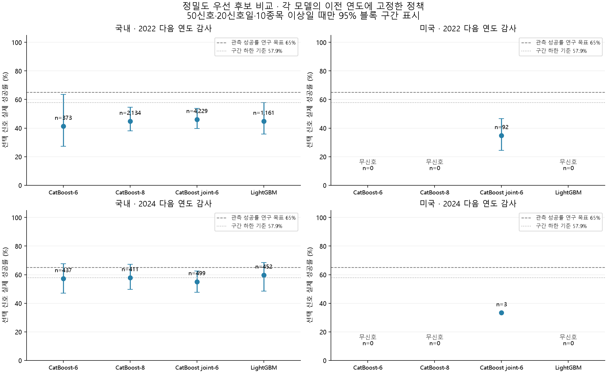
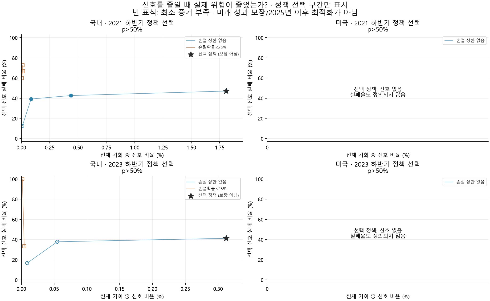
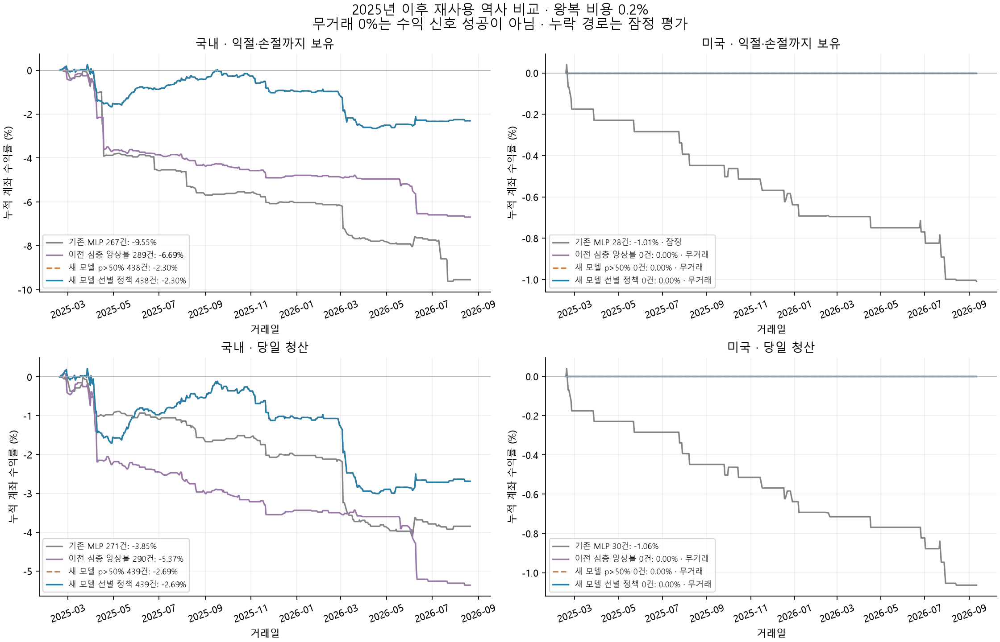
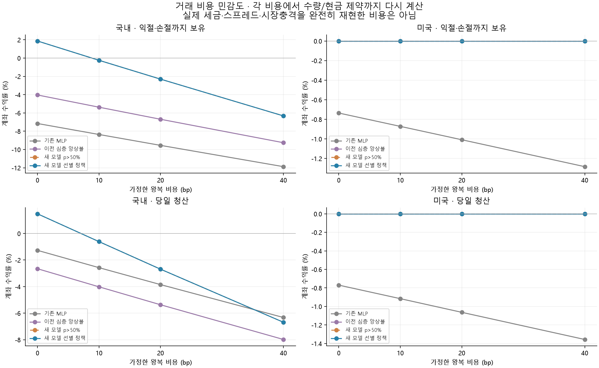

# mark_1 정밀도 우선 선별 모델 연구

신호가 드물어도 실제 매수 신호 성공률을 높이려는 별도 연구다. 원본/정제 DB·기존 모델을 바꾸지 않고 자동주문도 하지 않았다.

## 결론

**양 시장 모두 사전 연구 기준 미통과다. 신호를 드물게 만들면서 높은 정확도를 확보했다는 목표는 달성하지 못했다.**

- 국내: `cat_joint6`, p>50%. 두 감사 구간과 정책 선택 구간의 사전 연구 기준 **미통과**. 재사용 역사에서 이전 심층 모델 성공률 36.16% → 새 모델 49.89%; 신호 307 → 441개(**증가**). 선별 정책 보유형 -2.30%, 당일 청산 -2.69%.
  - 이전 심층 모델 대비 비용20bp 보유형 -6.69% → -2.30%, 당일 청산 -5.37% → -2.69%. 두 방식 모두 여전히 손실이다.
  - 전체 기간 성공률의95% 블록 구간은 41.43%–59.38%다. 2025년 344신호 / 53.49%; 2026년 97신호 / 37.11%. 기간별 변화는 사후 기술 통계이며 이를 근거로 문턱을 재선택하지 않았다.
  - 최종 정책은 추가 제한 없는 p>50%여서 새 모델의 무선별/선별 신호가 동일하다. **신호 보류·희소화의 개선 효과를 입증한 결과가 아니다.**
- 미국: `cat_binary8`, p>50%. 두 감사 구간과 정책 선택 구간의 사전 연구 기준 **미통과**. 재사용 역사에서 이전 심층 모델 성공률 — → 새 모델 —; 신호 0 → 0개(**동일**). 선별 정책 보유형 0.00%, 당일 청산 0.00%.
  - 최종 정책은 추가 제한 없는 p>50%여서 새 모델의 무선별/선별 신호가 동일하다. **신호 보류·희소화의 개선 효과를 입증한 결과가 아니다.**
  - 미국 시장은 무신호다. 성공률은 정의되지 않으며 무거래 수익률 0%를 성공으로 보지 않는다.

65%는 관측 성공률의 사전 연구 목표이며 달성 보장이나 실거래 승률 약속이 아니다. 연구 통과 여부와 관계없이 자동매매에 배포하지 않았다.

2025년 이후 자료는 이전 연구에서 이미 본 **재사용 역사 평가**다. 모델/임계값을 이 결과에 맞춰 다시 고르지 않았다. 2022/2024 감사 또한 구조 선택에 쓰였으므로 완전히 독립된 최종 시험이 아니다.

## 학습과 분리

실제 기록: **24회 학습**, 진행 27,332 boosting iteration, 각 실험의 최적 체크포인트에 남긴 iteration 합 24,113, 순수 fit 시간 합 11.8분. 이는 딥러닝 epoch·학습 파라미터 수·전체 경과 시간과 다른 값이다.

| 구간 | 모델 학습 | 종료 검증 | 확률 보정 | 정책 선택 | 다음 연도 감사 |
|---|---|---|---|---|---|
| walk_2022 | 2012–2019 | 2020 | 2021 상반기 | 2021 하반기 | 2022 |
| walk_2024 | 2014–2021 | 2022 | 2023 상반기 | 2023 하반기 | 2024 |

후속 연도 및 반기 경계에는 30거래일 입력 겹침 제거를 적용했다. 완료된 과거30봉과 실제 당일 시가만 입력한다. 당일 최종 고가/저가/종가/전체 거래량은 입력에서 제외한다. 고가/저가는 장벽 정답, 종가는 미접촉 수익 계산에 쓰이고 거래량은 정제 시 관측/거래 존재 조건에 관여한다. 이번 학습은 실제 시가 표본이며 임의가격 증강을 사용하지 않았다.

CatBoost depth6/8 이진분류, joint depth6의 네 장벽 사건 분류, LightGBM을 비교했다. 184개 과거 가격/변동성/봉 형태/거래량 특징을 사용한다. 새로운 깊은 신경망이나 논문 완전 재현이라고 부르지 않는다. 구조를 고른 뒤 두 구간 모두 고정 seed42/43/44 앙상블을 만들었다.

정책은 확률>.50/.55/.60/.65/.70/.75/.80/.85/.90/.95 중 선택하며 joint만 손절확률≤25% 조건도 비교한다. p>50%는 기본 최소 조건이다. 성공확률과 손절확률을 독립이라고 가정해 곱하지 않는다.

최소50신호·20신호일·10종목, 관측 성공률≥65%, 10거래일/2,000회 블록95% 성공률 하한>57.9%, 왕복20bp 후 평균 proxy 수익 하한>0을 요구한다. 이는 금융 시계열/다중 모델 선택 불확실성을 모두 보정하는 확률 보장이 아니다.

## 후보별 다음 연도 감사

확률 오차(Brier)는 신호에서 탈락한 확률을 0으로 바꾸지 않은 전체 표본 기준이다. 신호 성공률과 별개다.

### 국내 · 2022 감사

| 후보 | 고정 정책 | 신호/날짜/종목 | 실제 성공률 | 95% 구간 | 평균 순수익 proxy | Brier | 선택 iteration |
|---|---|---:|---:|---|---:|---:|---:|
| CatBoost-6 | p>55% | 373/50/209 | 41.29% | 27.19%–63.50% | -0.303% | 0.19517 | 391 |
| CatBoost-8 | p>50% | 2,134/133/572 | 44.75% | 38.14%–54.68% | -0.235% | 0.19518 | 240 |
| CatBoost joint-6 | p>50% | 4,229/186/822 | 46.04% | 39.69%–53.69% | -0.198% | 0.19471 | 1,844 |
| LightGBM | p>50% | 1,161/98/430 | 44.79% | 35.79%–57.89% | -0.239% | 0.19518 | 144 |

고정 3-seed 앙상블: p>50%; 신호 4,288, 실제 성공률 46.15%, 95% 구간 39.88%–53.75%, 평균 순수익 proxy -0.194%. 정책 선택 구간 미통과, 다음 연도 감사 미통과.

### 국내 · 2024 감사

| 후보 | 고정 정책 | 신호/날짜/종목 | 실제 성공률 | 95% 구간 | 평균 순수익 proxy | Brier | 선택 iteration |
|---|---|---:|---:|---|---:|---:|---:|
| CatBoost-6 | p>50% | 437/100/232 | 57.21% | 46.99%–67.56% | -0.008% | 0.17905 | 1,611 |
| CatBoost-8 | p>50% | 411/99/208 | 57.91% | 49.70%–67.16% | 0.006% | 0.17911 | 996 |
| CatBoost joint-6 | p>50% | 499/117/245 | 55.11% | 47.68%–62.59% | -0.036% | 0.17895 | 2,945 |
| LightGBM | p>50% | 452/99/235 | 59.73% | 48.51%–68.44% | 0.037% | 0.17894 | 1,674 |

고정 3-seed 앙상블: p>50%; 신호 488, 실제 성공률 55.33%, 95% 구간 48.00%–62.97%, 평균 순수익 proxy -0.036%. 정책 선택 구간 미통과, 다음 연도 감사 미통과.

### 미국 · 2022 감사

| 후보 | 고정 정책 | 신호/날짜/종목 | 실제 성공률 | 95% 구간 | 평균 순수익 proxy | Brier | 선택 iteration |
|---|---|---:|---:|---|---:|---:|---:|
| CatBoost-6 | p>50% | 0/0/0 | — | 증거 부족 | — | 0.20491 | 174 |
| CatBoost-8 | p>50% | 0/0/0 | — | 증거 부족 | — | 0.20486 | 137 |
| CatBoost joint-6 | p>50% | 92/52/66 | 34.78% | 24.32%–46.67% | -0.325% | 0.20521 | 2,359 |
| LightGBM | p>50% | 0/0/0 | — | 증거 부족 | — | 0.20497 | 89 |

고정 3-seed 앙상블: p>50%; 신호 0, 실제 성공률 —, 95% 구간 증거 부족, 평균 순수익 proxy —. 정책 선택 구간 미통과, 다음 연도 감사 미통과.

### 미국 · 2024 감사

| 후보 | 고정 정책 | 신호/날짜/종목 | 실제 성공률 | 95% 구간 | 평균 순수익 proxy | Brier | 선택 iteration |
|---|---|---:|---:|---|---:|---:|---:|
| CatBoost-6 | p>50% | 0/0/0 | — | 증거 부족 | — | 0.19704 | 8 |
| CatBoost-8 | p>50% | 0/0/0 | — | 증거 부족 | — | 0.19618 | 149 |
| CatBoost joint-6 | p>50% | 3/2/3 | 33.33% | 증거 부족 | -0.467% | 0.19614 | 701 |
| LightGBM | p>50% | 0/0/0 | — | 증거 부족 | — | 0.19631 | 95 |

고정 3-seed 앙상블: p>50%; 신호 0, 실제 성공률 —, 95% 구간 증거 부족, 평균 순수익 proxy —. 정책 선택 구간 미통과, 다음 연도 감사 미통과.

## 신호 빈도와 위험

아래 곡선은 선택된 구조의 앙상블에서 이전 연도 하반기 정책 선택 자료만 사용한다. 높은 확률 문턱이 언제나 실제 오류를 줄인다고 가정하지 않는다. 별표는 최종 선택 정책이며 성공을 보장하는 지점이 아니다.

### 국내: 왜 더 높은 문턱을 선택하지 못했는가?

아래는 결과에 맞춰 바꾼 문턱이 아니라 원래 정책 선택 구간에 저장된 후보 비교다. 높은 성공률이라도 몇 건에 불과하면 증거 기준을 통과하지 못한다.

| 정책 검증 기간 | 문턱 | 성공/신호 | 신호 날짜/종목 | 성공률 |95% 하한 | 평균 순수익 proxy | 충분한 증거 |
|---|---:|---:|---:|---:|---:|---:|---|
| 2021 하반기 | p>50% | 877/1,658 | 91/554 | 52.90% | 46.97% | -0.077% | 있음 |
| 2021 하반기 | p>55% | 230/401 | 62/212 | 57.36% | 45.45% | 0.007% | 있음 |
| 2021 하반기 | p>60% | 48/79 | 26/57 | 60.76% | 45.83% | 0.090% | 있음 |
| 2021 하반기 | p>65% | 7/8 | 4/8 | 87.50% | — | 0.562% | 부족 |

2021 하반기: 더 높은 문턱은 점추정 성공률을 높였지만 정밀도 신뢰구간 하한이 p>50%보다 낮았다. 손절확률25% 제한을 더하면 최대 15신호만 남았다. 충분한 증거가 있는 후보의 비용 차감 수익 신뢰구간 하한도 양수가 아니었다.

| 정책 검증 기간 | 문턱 | 성공/신호 | 신호 날짜/종목 | 성공률 |95% 하한 | 평균 순수익 proxy | 충분한 증거 |
|---|---:|---:|---:|---:|---:|---:|---|
| 2023 하반기 | p>50% | 124/211 | 50/137 | 58.77% | 52.26% | 0.031% | 있음 |
| 2023 하반기 | p>55% | 23/37 | 18/29 | 62.16% | — | 0.102% | 부족 |
| 2023 하반기 | p>60% | 5/6 | 5/5 | 83.33% | — | 0.483% | 부족 |
| 2023 하반기 | p>65% | 0/0 | 0/0 | — | — | — | 부족 |

2023 하반기: 더 높은 문턱은 신호/날짜/종목의 최소 증거량을 채우지 못했다. 손절확률25% 제한을 더하면 최대 3신호만 남았다. 충분한 증거가 있는 후보의 비용 차감 수익 신뢰구간 하한도 양수가 아니었다.

## 2025년 이후 재사용 역사 비교

네 모델/정책은 시장별 동일한 원본 표본을 평가하지만 발생 신호와 거래 집합은 다르다. 새 모델의 무선별/선별 비교는 정확히 같은 확률에 마스크만 달리 적용한다. 신호 수는 체결 가능한 실제 매매 수가 아니다.

| 시장/모델 | 원신호 | 실제 성공률 | 95% 구간 | 신호 비율 | 전체 Brier |
|---|---:|---:|---|---:|---:|
| 국내 · 기존 MLP | 324 | 41.36% | 27.24%–53.33% | 0.1240% | 0.16105 |
| 국내 · 이전 심층 앙상블 | 307 | 36.16% | 29.78%–45.73% | 0.1175% | 0.15989 |
| 국내 · 새 모델 p>50% | 441 | 49.89% | 41.43%–59.38% | 0.1687% | 0.15917 |
| 국내 · 새 모델 선별 정책 | 441 | 49.89% | 41.43%–59.38% | 0.1687% | 0.15917 |
| 미국 · 기존 MLP | 30 | 13.33% | 증거 부족 | 0.0028% | 0.19850 |
| 미국 · 이전 심층 앙상블 | 0 | — | 증거 부족 | 0.0000% | 0.19739 |
| 미국 · 새 모델 p>50% | 0 | — | 증거 부족 | 0.0000% | 0.19692 |
| 미국 · 새 모델 선별 정책 | 0 | — | 증거 부족 | 0.0000% | 0.19692 |

자본 국내1천만원/미국1만달러, 최대20보유, 종목당5%, 과거20일 거래량 중앙값의0.1% 한도, 정수수량, 왕복20bp 비용 가정이다. 시가 진입에 오후 매도금을 미리 사용할 수 없다. 두 장벽 동시 도달은 손절 우선, 이전 보유의 시가 갭은 관측 시가로 처리한다.

### 국내 계좌 결과

2025-02-19–2026-08-21, 368거래일, 동일 적격 표본 261,385개.

| 모델/청산 | 거래 수 | 거래 순수익 승률 | 계좌 수익률 | 최대 낙폭 | 관측 상태 |
|---|---:|---:|---:|---:|---|
| 기존 MLP / 익절·손절까지 보유 | 267 | 41.20% | -9.55% | -9.62% | 완전 관측 |
| 기존 MLP / 당일 청산 | 271 | 40.59% | -3.85% | -4.10% | 완전 관측 |
| 이전 심층 앙상블 / 익절·손절까지 보유 | 289 | 37.37% | -6.69% | -6.78% | 완전 관측 |
| 이전 심층 앙상블 / 당일 청산 | 290 | 37.24% | -5.37% | -5.46% | 완전 관측 |
| 새 모델 p>50% / 익절·손절까지 보유 | 438 | 51.83% | -2.30% | -2.91% | 완전 관측 |
| 새 모델 p>50% / 당일 청산 | 439 | 51.25% | -2.69% | -3.21% | 완전 관측 |
| 새 모델 선별 정책 / 익절·손절까지 보유 | 438 | 51.83% | -2.30% | -2.91% | 완전 관측 |
| 새 모델 선별 정책 / 당일 청산 | 439 | 51.25% | -2.69% | -3.21% | 완전 관측 |

### 미국 계좌 결과

2025-02-18–2026-09-11, 394거래일, 동일 적격 표본 1,077,696개.

| 모델/청산 | 거래 수 | 거래 순수익 승률 | 계좌 수익률 | 최대 낙폭 | 관측 상태 |
|---|---:|---:|---:|---:|---|
| 기존 MLP / 익절·손절까지 보유 | 28 | 17.86% | -1.01% | -1.05% | 잠정 · 불확실 거래 2건 |
| 기존 MLP / 당일 청산 | 30 | 13.33% | -1.06% | -1.10% | 완전 관측 |
| 이전 심층 앙상블 / 익절·손절까지 보유 | 0 | — | 0.00% | 0.00% | 완전 관측 · 무거래 |
| 이전 심층 앙상블 / 당일 청산 | 0 | — | 0.00% | 0.00% | 완전 관측 · 무거래 |
| 새 모델 p>50% / 익절·손절까지 보유 | 0 | — | 0.00% | 0.00% | 완전 관측 · 무거래 |
| 새 모델 p>50% / 당일 청산 | 0 | — | 0.00% | 0.00% | 완전 관측 · 무거래 |
| 새 모델 선별 정책 / 익절·손절까지 보유 | 0 | — | 0.00% | 0.00% | 완전 관측 · 무거래 |
| 새 모델 선별 정책 / 당일 청산 | 0 | — | 0.00% | 0.00% | 완전 관측 · 무거래 |

## 비용 민감도

| 시장/모델/청산 | 0bp | 10bp | 20bp | 40bp |
|---|---:|---:|---:|---:|
| 국내 / 기존 MLP / 익절·손절까지 보유 | -7.16% | -8.36% | -9.55% | -11.88% |
| 국내 / 기존 MLP / 당일 청산 | -1.27% | -2.57% | -3.85% | -6.33% |
| 국내 / 이전 심층 앙상블 / 익절·손절까지 보유 | -4.04% | -5.37% | -6.69% | -9.26% |
| 국내 / 이전 심층 앙상블 / 당일 청산 | -2.66% | -4.02% | -5.37% | -7.98% |
| 국내 / 새 모델 p>50% / 익절·손절까지 보유 | 1.87% | -0.24% | -2.30% | -6.33% |
| 국내 / 새 모델 p>50% / 당일 청산 | 1.48% | -0.61% | -2.69% | -6.69% |
| 국내 / 새 모델 선별 정책 / 익절·손절까지 보유 | 1.87% | -0.24% | -2.30% | -6.33% |
| 국내 / 새 모델 선별 정책 / 당일 청산 | 1.48% | -0.61% | -2.69% | -6.69% |
| 미국 / 기존 MLP / 익절·손절까지 보유 | -0.74% | -0.87% | -1.01% | -1.28% |
| 미국 / 기존 MLP / 당일 청산 | -0.77% | -0.92% | -1.06% | -1.36% |
| 미국 / 이전 심층 앙상블 / 익절·손절까지 보유 | 0.00% | 0.00% | 0.00% | 0.00% |
| 미국 / 이전 심층 앙상블 / 당일 청산 | 0.00% | 0.00% | 0.00% | 0.00% |
| 미국 / 새 모델 p>50% / 익절·손절까지 보유 | 0.00% | 0.00% | 0.00% | 0.00% |
| 미국 / 새 모델 p>50% / 당일 청산 | 0.00% | 0.00% | 0.00% | 0.00% |
| 미국 / 새 모델 선별 정책 / 익절·손절까지 보유 | 0.00% | 0.00% | 0.00% | 0.00% |
| 미국 / 새 모델 선별 정책 / 당일 청산 | 0.00% | 0.00% | 0.00% | 0.00% |

## 기간별 안정성과 종목 집중

아래는 사전에 고정한 선별 정책의 사후 기술 통계이며 이를 보고 정책을 다시 선택하지 않았다. 작은 분기의 높은 성공률은 별도의 신뢰구간/유의성 보장이 아니다. 한 종목에 신호가 몰리면 전체 성공률을 일반화하기 어렵다.

| 시장/모델 | 신호 종목 수 | 가장 큰 한 종목의 신호 비중 |
|---|---:|---:|
| 국내 / 기존 MLP | 242 | 1.54% |
| 국내 / 이전 심층 앙상블 | 170 | 4.56% |
| 국내 / 새 모델 p>50% | 206 | 10.66% |
| 국내 / 새 모델 선별 정책 | 206 | 10.66% |
| 미국 / 기존 MLP | 17 | 16.67% |
| 미국 / 이전 심층 앙상블 | 0 | — |
| 미국 / 새 모델 p>50% | 0 | — |
| 미국 / 새 모델 선별 정책 | 0 | — |

### 국내 선별 정책 기간별

| 기간 | 신호 수 | 신호 날짜/종목 | 실제 성공률 | 평균 순수익 proxy | 최대 한 종목 비중 |
|---|---:|---:|---:|---:|---:|
| 2025 | 344 | 126/155 | 53.49% | -0.056% | 13.37% |
| 2026 | 97 | 40/73 | 37.11% | -0.349% | 5.15% |
| 2025Q1 | 57 | 19/46 | 52.63% | -0.082% | 5.26% |
| 2025Q2 | 152 | 37/87 | 53.29% | -0.085% | 11.18% |
| 2025Q3 | 86 | 46/32 | 62.79% | 0.166% | 27.91% |
| 2025Q4 | 49 | 24/37 | 38.78% | -0.330% | 8.16% |
| 2026Q1 | 63 | 21/50 | 22.22% | -0.622% | 7.94% |
| 2026Q2 | 31 | 16/24 | 64.52% | 0.155% | 9.68% |
| 2026Q3 | 3 | 3/3 | 66.67% | 0.167% | 33.33% |

### 미국 선별 정책 기간별

| 기간 | 신호 수 | 신호 날짜/종목 | 실제 성공률 | 평균 순수익 proxy | 최대 한 종목 비중 |
|---|---:|---:|---:|---:|---:|
| 2025 | 0 | 0/0 | — | — | — |
| 2026 | 0 | 0/0 | — | — | — |
| 2025Q1 | 0 | 0/0 | — | — | — |
| 2025Q2 | 0 | 0/0 | — | — | — |
| 2025Q3 | 0 | 0/0 | — | — | — |
| 2025Q4 | 0 | 0/0 | — | — | — |
| 2026Q1 | 0 | 0/0 | — | — | — |
| 2026Q2 | 0 | 0/0 | — | — | — |
| 2026Q3 | 0 | 0/0 | — | — | — |

## 검증 상태

독립 장부 점검: 64개 비용·모델·청산 조합, 거래 행 11,716개. 동일 거래의 비용별 재계산을 포함한 행 수이며 실제 계좌 거래 수가 아니다.

현금/수량/비용/손익 대사와 선택 마스크·지표 일치 점검은 통과했다.
미국 이전 심층 모델의 확률 최대 차이 0.00086132가 기록되었다 (이전 batch 2048, 이번 8192, BF16). 배치 크기가 달라도 확률이 완전히 같았다고 주장하지 않는다.
추가 재계산에서 이전 배치의 전체 1,077,696표본은 이전 확률을 정확히 재현했고, 새 배치의 정렬된 106,496표본은 새 확률을 정확히 재현했다. BF16 배치 크기에 따른 수치 차이로 분리 확인했으며, 원래 차이를 숨기거나 판정 허용오차를 늘리지 않았다.
회계·선택 검증은 통과했고, 비교 모델의 배치 의존 수치 차이는 추가 재계산으로 확인해 기록했다. 이는 모든 하드웨어/배치에서 비트 단위 확률이 같다는 보장이 아니다.
이전 비교 모델의 p>50% 매수 마스크는 동일했으며 미국 심층 모델은 양 실행 모두 무신호다.

## 해석의 한계

- 일봉 전체의 성공 정답이지 임의 장중 진입 이후 +1%가 −0.9%보다 먼저 도달할 확률이 아니다. 실제 진입 이후 경로에는 분봉/체결 자료가 필요하다.
- 현재 목록의 생존 편향, 수정주가 일관성, 승인/정제 표본 선택, 누락된 보유 가격 경로, 실제 세금·스프레드·시장충격 불확실성이 남는다.
- 양성 신호 정밀도·전체 정확도·개별 거래 순수익 승률·계좌 수익률은 다른 지표다. 최소 증거 없는 높은 성공률이나 거래가 없는0%를 성과로 인정하지 않는다.
- 정책/구조를 고른 자료의 신뢰구간은 선택 이후의 독립 확률 보장이 아니다. 완전히 새로운 미래 구간의 고정 예측과 비용/체결 검증 전에는 배포하지 않는다.

[고정 연구 계획](../../docs/mark1-selective-protocol.md) · [관련 논문 검토](../../docs/mark1-selective-literature.md)
